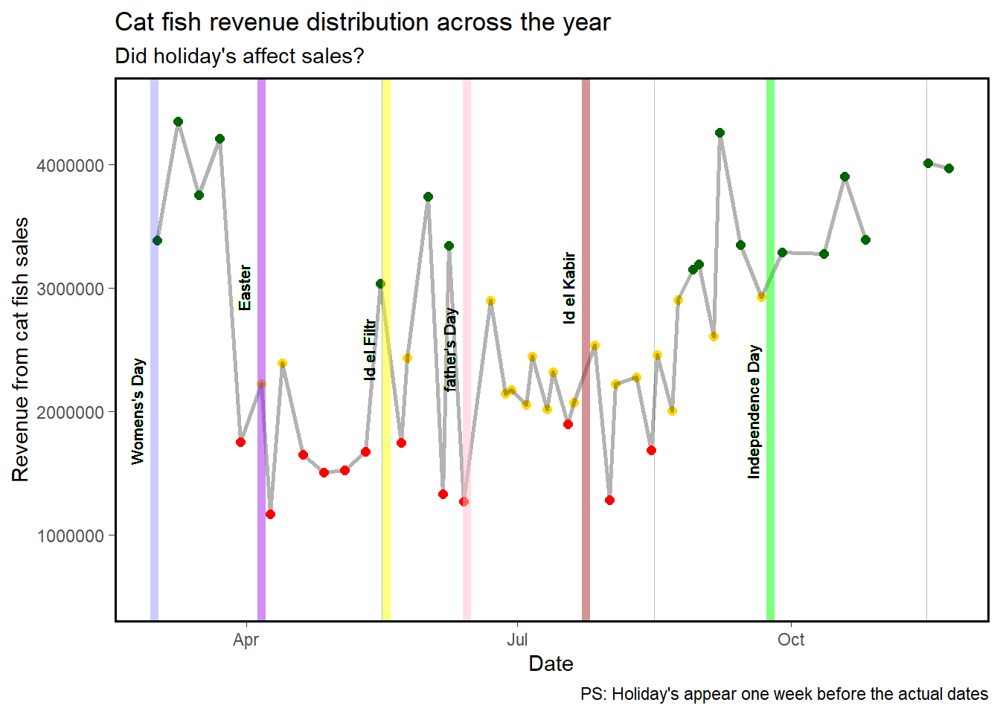

# Project Description
This is a voluntary project conducted for a catfish farm in Abuja. The objective of the project was: <br>
1. To present the list of debtors and how much they owe the catfish farm. <br>
2. To analyze the data from the farm for useful insights for growth.

The data used was the sales record of the fish farm in excel format. The workbook contained 56 sheets detailing sales from different days. Each sheet contained the names of the buyer, the different types of fishes sold by the farm, the weight of the fishes in grams, the amount per gram for each fish, the total quantity of fish purchased by each buyer, the amount paid by the buyer, the balance unpaid (if applicable), and the balance owed by the farm (if applicable). 

## Process description
1. The sales data was read into a list in R, with each sheet in the workbook converted to a data frame in the list <br>
2. A function was written (Farmdebtors function) to clean, group, arrange and filter the data. The output of the function was a data frame of four columns: name of debtor, amount due, amount paid, and balance unpaid. <br>
3. The list was written back to an excel workbook and sent to the client. Unfortunately, due to data protection regulations, the list can not be displayed in this write-up.<br>
4. Another function was written(Farm analytics function) to prepare the data for visualization and analysis.  <br>
5. visualization was achieved using the ggplot2 library. The goal of visualizing the data was to understand the following: <br>
  A. what fish types sold the most and the least? <br>
  B. what days of the week were best for sales (this was useful in planning staff work schedule)?  <br>
  C. was fish sales influenced by any event during the year?

## Result summary
Insight 1: Fish types labeled “s” and “ss” in the sales records had the most sales on the farm. Approximately 61 % of all fish sold throughout the year from the fish farm were “s” (30.3 %) and “ss” (30.2 %). Meanwhile, negligible quantities of PRE-BROOD and BROODSTOCK fish was sold all year. 

Insight 2: It was discovered that Mondays were the best days for sales. 76 % of all sales were made on a Monday. No sale was done on Tuesdays and Wednesdays. It should be noted that the cause of this trend can not be explained from the data set made available for this project. Future projects might consider looking further into this trend. 

Insight 3: It can not be concluded from the data that any of the nationwide holidays in Nigeria, had any impact on the sales of fish. Future projects can look into the effect of other factors 

## R Libraries 
The following R libraries were used for this project: <br>
1. tidyverse <br>
2. readxl <br>
3. dplyr <br>
4. reshape2 <br>
5. ggplot2 <br>
6. shiny <br>
7. plotly <br>
8. scales 


## Insights 1
*what fish sells the most and the least?*

PLOT 1

```{=html}
<div id="htmlwidget-043676c863d51ad97a7f" style="width:672px;height:480px;" class="plotly html-widget"></div>
<script type="application/json" data-for="htmlwidget-043676c863d51ad97a7f">{"x":{"data":[{"orientation":"v","width":364.6,"base":0.55,"x":[182.3],"y":[0.9],"text":"Fish type: BROODSTOCK<br />Total grams sold: 364.6<br />% of total sales: 0.2","type":"bar","marker":{"autocolorscale":false,"color":"rgba(248,118,109,1)","line":{"width":1.88976377952756,"color":"transparent"}},"name":"BROODSTOCK","legendgroup":"BROODSTOCK","showlegend":true,"xaxis":"x","yaxis":"y","hoverinfo":"text","frame":null},{"orientation":"v","width":40023,"base":1.55,"x":[20011.5],"y":[0.9],"text":"Fish type: B.<br />Total grams sold: 40023<br />% of total sales: 22.42","type":"bar","marker":{"autocolorscale":false,"color":"rgba(205,150,0,1)","line":{"width":1.88976377952756,"color":"transparent"}},"name":"B.","legendgroup":"B.","showlegend":true,"xaxis":"x","yaxis":"y","hoverinfo":"text","frame":null},{"orientation":"v","width":53908.2,"base":2.55,"x":[26954.1],"y":[0.9],"text":"Fish type: S<br />Total grams sold: 53908.2<br />% of total sales: 30.2","type":"bar","marker":{"autocolorscale":false,"color":"rgba(124,174,0,1)","line":{"width":1.88976377952756,"color":"transparent"}},"name":"S","legendgroup":"S","showlegend":true,"xaxis":"x","yaxis":"y","hoverinfo":"text","frame":null},{"orientation":"v","width":54053.5,"base":3.55,"x":[27026.75],"y":[0.9],"text":"Fish type: SS<br />Total grams sold: 54053.5<br />% of total sales: 30.28","type":"bar","marker":{"autocolorscale":false,"color":"rgba(0,190,103,1)","line":{"width":1.88976377952756,"color":"transparent"}},"name":"SS","legendgroup":"SS","showlegend":true,"xaxis":"x","yaxis":"y","hoverinfo":"text","frame":null},{"orientation":"v","width":18297.9,"base":4.55,"x":[9148.95],"y":[0.9],"text":"Fish type: DRY<br />Total grams sold: 18297.9<br />% of total sales: 10.25","type":"bar","marker":{"autocolorscale":false,"color":"rgba(0,191,196,1)","line":{"width":1.88976377952756,"color":"transparent"}},"name":"DRY","legendgroup":"DRY","showlegend":true,"xaxis":"x","yaxis":"y","hoverinfo":"text","frame":null},{"orientation":"v","width":635.8,"base":5.55,"x":[317.9],"y":[0.9],"text":"Fish type: WEAK<br />Total grams sold: 635.8<br />% of total sales: 0.36","type":"bar","marker":{"autocolorscale":false,"color":"rgba(0,169,255,1)","line":{"width":1.88976377952756,"color":"transparent"}},"name":"WEAK","legendgroup":"WEAK","showlegend":true,"xaxis":"x","yaxis":"y","hoverinfo":"text","frame":null},{"orientation":"v","width":56,"base":6.55,"x":[28],"y":[0.9],"text":"Fish type: PRE-BROOD<br />Total grams sold: 56<br />% of total sales: 0.03","type":"bar","marker":{"autocolorscale":false,"color":"rgba(199,124,255,1)","line":{"width":1.88976377952756,"color":"transparent"}},"name":"PRE-BROOD","legendgroup":"PRE-BROOD","showlegend":true,"xaxis":"x","yaxis":"y","hoverinfo":"text","frame":null},{"orientation":"v","width":11179.1,"base":7.55,"x":[5589.55],"y":[0.899999999999999],"text":"Fish type: DRY/WEAK<br />Total grams sold: 11179.1<br />% of total sales: 6.26","type":"bar","marker":{"autocolorscale":false,"color":"rgba(255,97,204,1)","line":{"width":1.88976377952756,"color":"transparent"}},"name":"DRY/WEAK","legendgroup":"DRY/WEAK","showlegend":true,"xaxis":"x","yaxis":"y","hoverinfo":"text","frame":null}],"layout":{"margin":{"t":43.7625570776256,"r":7.30593607305936,"b":40.1826484018265,"l":84.0182648401827},"plot_bgcolor":"rgba(255,255,255,1)","paper_bgcolor":"rgba(255,255,255,1)","font":{"color":"rgba(0,0,0,1)","family":"","size":14.6118721461187},"title":{"text":"Cat-fish sales distibution by weight from March - Nov 2020","font":{"color":"rgba(0,0,0,1)","family":"","size":17.5342465753425},"x":0,"xref":"paper"},"xaxis":{"domain":[0,1],"automargin":true,"type":"linear","autorange":false,"range":[-2750,57750],"tickmode":"array","ticktext":["0","20000","40000"],"tickvals":[0,20000,40000],"categoryorder":"array","categoryarray":["0","20000","40000"],"nticks":null,"ticks":"outside","tickcolor":"rgba(51,51,51,1)","ticklen":3.65296803652968,"tickwidth":0.66417600664176,"showticklabels":true,"tickfont":{"color":"rgba(77,77,77,1)","family":"","size":11.689497716895},"tickangle":-0,"showline":false,"linecolor":null,"linewidth":0,"showgrid":true,"gridcolor":"rgba(235,235,235,1)","gridwidth":0.66417600664176,"zeroline":false,"anchor":"y","title":{"text":"Weight of fish purchased (gram)","font":{"color":"rgba(0,0,0,1)","family":"","size":14.6118721461187}},"hoverformat":".2f"},"yaxis":{"domain":[0,1],"automargin":true,"type":"linear","autorange":false,"range":[0.4,8.6],"tickmode":"array","ticktext":["BROODSTOCK","B.","S","SS","DRY","WEAK","PRE-BROOD","DRY/WEAK"],"tickvals":[1,2,3,4,5,6,7,8],"categoryorder":"array","categoryarray":["BROODSTOCK","B.","S","SS","DRY","WEAK","PRE-BROOD","DRY/WEAK"],"nticks":null,"ticks":"outside","tickcolor":"rgba(51,51,51,1)","ticklen":3.65296803652968,"tickwidth":0.66417600664176,"showticklabels":true,"tickfont":{"color":"rgba(77,77,77,1)","family":"","size":11.689497716895},"tickangle":-0,"showline":false,"linecolor":null,"linewidth":0,"showgrid":true,"gridcolor":"rgba(235,235,235,1)","gridwidth":0.66417600664176,"zeroline":false,"anchor":"x","title":{"text":"Type of fish","font":{"color":"rgba(0,0,0,1)","family":"","size":14.6118721461187}},"hoverformat":".2f"},"shapes":[{"type":"rect","fillcolor":"transparent","line":{"color":"rgba(51,51,51,1)","width":0.66417600664176,"linetype":"solid"},"yref":"paper","xref":"paper","x0":0,"x1":1,"y0":0,"y1":1}],"showlegend":true,"legend":{"bgcolor":"rgba(255,255,255,1)","bordercolor":"transparent","borderwidth":1.88976377952756,"font":{"color":"rgba(0,0,0,1)","family":"","size":11.689497716895},"y":0.93503937007874},"annotations":[{"text":"Type of fish","x":1.02,"y":1,"showarrow":false,"ax":0,"ay":0,"font":{"color":"rgba(0,0,0,1)","family":"","size":14.6118721461187},"xref":"paper","yref":"paper","textangle":-0,"xanchor":"left","yanchor":"bottom","legendTitle":true}],"hovermode":"closest","barmode":"relative"},"config":{"doubleClick":"reset","showSendToCloud":false},"source":"A","attrs":{"2c582ac56950":{"x":{},"y":{},"fill":{},"text":{},"type":"bar"}},"cur_data":"2c582ac56950","visdat":{"2c582ac56950":["function (y) ","x"]},"highlight":{"on":"plotly_click","persistent":false,"dynamic":false,"selectize":false,"opacityDim":0.2,"selected":{"opacity":1},"debounce":0},"shinyEvents":["plotly_hover","plotly_click","plotly_selected","plotly_relayout","plotly_brushed","plotly_brushing","plotly_clickannotation","plotly_doubleclick","plotly_deselect","plotly_afterplot","plotly_sunburstclick"],"base_url":"https://plot.ly"},"evals":[],"jsHooks":[]}</script>
```
## Insights 2
*what days of the week had the most fish sales?*

Plot 2

```{=html}
<div id="htmlwidget-13aa8130b30eb9040ae9" style="width:672px;height:480px;" class="plotly html-widget"></div>
<script type="application/json" data-for="htmlwidget-13aa8130b30eb9040ae9">{"x":{"data":[{"orientation":"v","width":[0,520848,786324,929344,0,0,0,590700],"base":[0.55,1.55,2.55,3.55,4.55,5.55,6.55,7.55],"x":[462720,29466493.2,38027186,34827804,11238816,395514,31200,6294560],"y":[0.9,0.9,0.9,0.9,0.9,0.9,0.9,0.899999999999999],"text":["Fish type: Amount_BROODSTOCK<br />Sales in Naira: 0<br />Day of the week:Friday<br />% sales: 0","Fish type: Amount_B.<br />Sales in Naira: 520848<br />Day of the week:Friday<br />% sales: 0.43","Fish type: Amount_S<br />Sales in Naira: 786324<br />Day of the week:Friday<br />% sales: 0.64","Fish type: Amount_SS<br />Sales in Naira: 929344<br />Day of the week:Friday<br />% sales: 0.76","Fish type: Amount_DRY<br />Sales in Naira: 0<br />Day of the week:Friday<br />% sales: 0","Fish type: Amount_WEAK<br />Sales in Naira: 0<br />Day of the week:Friday<br />% sales: 0","Fish type: Amount_PRE-BROOD<br />Sales in Naira: 0<br />Day of the week:Friday<br />% sales: 0","Fish type: Amount_DRY/WEAK<br />Sales in Naira: 590700<br />Day of the week:Friday<br />% sales: 0.48"],"type":"bar","marker":{"autocolorscale":false,"color":"rgba(248,118,109,1)","line":{"width":1.88976377952756,"color":"transparent"}},"name":"Friday","legendgroup":"Friday","showlegend":true,"xaxis":"x","yaxis":"y","hoverinfo":"text","frame":null},{"orientation":"v","width":[462720,21486416.2,29907310,27190405,8829239,355489,0,4631313],"base":[0.55,1.55,2.55,3.55,4.55,5.55,6.55,7.55],"x":[231360,18462861.1,22680369,20767929.5,6824196.5,217769.5,31200,3683553.5],"y":[0.9,0.9,0.9,0.9,0.9,0.9,0.9,0.899999999999999],"text":["Fish type: Amount_BROODSTOCK<br />Sales in Naira: 462720<br />Day of the week:Monday<br />% sales: 0.38","Fish type: Amount_B.<br />Sales in Naira: 21486416.2<br />Day of the week:Monday<br />% sales: 17.59","Fish type: Amount_S<br />Sales in Naira: 29907310<br />Day of the week:Monday<br />% sales: 24.48","Fish type: Amount_SS<br />Sales in Naira: 27190405<br />Day of the week:Monday<br />% sales: 22.26","Fish type: Amount_DRY<br />Sales in Naira: 8829239<br />Day of the week:Monday<br />% sales: 7.23","Fish type: Amount_WEAK<br />Sales in Naira: 355489<br />Day of the week:Monday<br />% sales: 0.29","Fish type: Amount_PRE-BROOD<br />Sales in Naira: 0<br />Day of the week:Monday<br />% sales: 0","Fish type: Amount_DRY/WEAK<br />Sales in Naira: 4631313<br />Day of the week:Monday<br />% sales: 3.79"],"type":"bar","marker":{"autocolorscale":false,"color":"rgba(124,174,0,1)","line":{"width":1.88976377952756,"color":"transparent"}},"name":"Monday","legendgroup":"Monday","showlegend":true,"xaxis":"x","yaxis":"y","hoverinfo":"text","frame":null},{"orientation":"v","width":[0,7222403,7291546,7015297,2409577,40025,31200,1291277],"base":[0.55,1.55,2.55,3.55,4.55,5.55,6.55,7.55],"x":[0,4108451.5,4080941,3665078.5,1204788.5,20012.5,15600,722258.5],"y":[0.9,0.9,0.9,0.9,0.9,0.9,0.9,0.899999999999999],"text":["Fish type: Amount_BROODSTOCK<br />Sales in Naira: 0<br />Day of the week:Saturday<br />% sales: 0","Fish type: Amount_B.<br />Sales in Naira: 7222403<br />Day of the week:Saturday<br />% sales: 5.91","Fish type: Amount_S<br />Sales in Naira: 7291546<br />Day of the week:Saturday<br />% sales: 5.97","Fish type: Amount_SS<br />Sales in Naira: 7015297<br />Day of the week:Saturday<br />% sales: 5.74","Fish type: Amount_DRY<br />Sales in Naira: 2409577<br />Day of the week:Saturday<br />% sales: 1.97","Fish type: Amount_WEAK<br />Sales in Naira: 40025<br />Day of the week:Saturday<br />% sales: 0.03","Fish type: Amount_PRE-BROOD<br />Sales in Naira: 31200<br />Day of the week:Saturday<br />% sales: 0.03","Fish type: Amount_DRY/WEAK<br />Sales in Naira: 1291277<br />Day of the week:Saturday<br />% sales: 1.06"],"type":"bar","marker":{"autocolorscale":false,"color":"rgba(0,191,196,1)","line":{"width":1.88976377952756,"color":"transparent"}},"name":"Saturday","legendgroup":"Saturday","showlegend":true,"xaxis":"x","yaxis":"y","hoverinfo":"text","frame":null},{"orientation":"v","width":[0,497250,435168,157430,0,0,0,76620],"base":[0.55,1.55,2.55,3.55,4.55,5.55,6.55,7.55],"x":[0,248625,217584,78715,0,0,0,38310],"y":[0.9,0.9,0.9,0.9,0.9,0.9,0.9,0.899999999999999],"text":["Fish type: Amount_BROODSTOCK<br />Sales in Naira: 0<br />Day of the week:Thursday<br />% sales: 0","Fish type: Amount_B.<br />Sales in Naira: 497250<br />Day of the week:Thursday<br />% sales: 0.41","Fish type: Amount_S<br />Sales in Naira: 435168<br />Day of the week:Thursday<br />% sales: 0.36","Fish type: Amount_SS<br />Sales in Naira: 157430<br />Day of the week:Thursday<br />% sales: 0.13","Fish type: Amount_DRY<br />Sales in Naira: 0<br />Day of the week:Thursday<br />% sales: 0","Fish type: Amount_WEAK<br />Sales in Naira: 0<br />Day of the week:Thursday<br />% sales: 0","Fish type: Amount_PRE-BROOD<br />Sales in Naira: 0<br />Day of the week:Thursday<br />% sales: 0","Fish type: Amount_DRY/WEAK<br />Sales in Naira: 76620<br />Day of the week:Thursday<br />% sales: 0.06"],"type":"bar","marker":{"autocolorscale":false,"color":"rgba(199,124,255,1)","line":{"width":1.88976377952756,"color":"transparent"}},"name":"Thursday","legendgroup":"Thursday","showlegend":true,"xaxis":"x","yaxis":"y","hoverinfo":"text","frame":null}],"layout":{"margin":{"t":43.7625570776256,"r":7.30593607305936,"b":86.9406392694064,"l":124.931506849315},"plot_bgcolor":"rgba(255,255,255,1)","paper_bgcolor":"rgba(255,255,255,1)","font":{"color":"rgba(0,0,0,1)","family":"","size":14.6118721461187},"title":{"text":"Fish sales across the days of the week","font":{"color":"rgba(0,0,0,1)","family":"","size":17.5342465753425},"x":0,"xref":"paper"},"xaxis":{"domain":[0,1],"automargin":true,"type":"linear","autorange":false,"range":[-1921017.4,40341365.4],"tickmode":"array","ticktext":["0","10,000,000","20,000,000","30,000,000","40,000,000"],"tickvals":[0,10000000,20000000,30000000,40000000],"categoryorder":"array","categoryarray":["0","10,000,000","20,000,000","30,000,000","40,000,000"],"nticks":null,"ticks":"outside","tickcolor":"rgba(51,51,51,1)","ticklen":3.65296803652968,"tickwidth":0.66417600664176,"showticklabels":true,"tickfont":{"color":"rgba(77,77,77,1)","family":"","size":11.689497716895},"tickangle":-90,"showline":false,"linecolor":null,"linewidth":0,"showgrid":true,"gridcolor":"rgba(235,235,235,1)","gridwidth":0.66417600664176,"zeroline":false,"anchor":"y","title":{"text":"Revenue from fish sales","font":{"color":"rgba(0,0,0,1)","family":"","size":14.6118721461187}},"hoverformat":".2f"},"yaxis":{"domain":[0,1],"automargin":true,"type":"linear","autorange":false,"range":[0.4,8.6],"tickmode":"array","ticktext":["Amount_BROODSTOCK","Amount_B.","Amount_S","Amount_SS","Amount_DRY","Amount_WEAK","Amount_PRE-BROOD","Amount_DRY/WEAK"],"tickvals":[1,2,3,4,5,6,7,8],"categoryorder":"array","categoryarray":["Amount_BROODSTOCK","Amount_B.","Amount_S","Amount_SS","Amount_DRY","Amount_WEAK","Amount_PRE-BROOD","Amount_DRY/WEAK"],"nticks":null,"ticks":"outside","tickcolor":"rgba(51,51,51,1)","ticklen":3.65296803652968,"tickwidth":0.66417600664176,"showticklabels":true,"tickfont":{"color":"rgba(77,77,77,1)","family":"","size":11.689497716895},"tickangle":-0,"showline":false,"linecolor":null,"linewidth":0,"showgrid":true,"gridcolor":"rgba(235,235,235,1)","gridwidth":0.66417600664176,"zeroline":false,"anchor":"x","title":{"text":"Types of fish ","font":{"color":"rgba(0,0,0,1)","family":"","size":14.6118721461187}},"hoverformat":".2f"},"shapes":[{"type":"rect","fillcolor":"transparent","line":{"color":"rgba(51,51,51,1)","width":0.66417600664176,"linetype":"solid"},"yref":"paper","xref":"paper","x0":0,"x1":1,"y0":0,"y1":1}],"showlegend":true,"legend":{"bgcolor":"rgba(255,255,255,1)","bordercolor":"transparent","borderwidth":1.88976377952756,"font":{"color":"rgba(0,0,0,1)","family":"","size":11.689497716895},"y":0.93503937007874},"annotations":[{"text":"Days of the week","x":1.02,"y":1,"showarrow":false,"ax":0,"ay":0,"font":{"color":"rgba(0,0,0,1)","family":"","size":14.6118721461187},"xref":"paper","yref":"paper","textangle":-0,"xanchor":"left","yanchor":"bottom","legendTitle":true}],"hovermode":"closest","barmode":"relative"},"config":{"doubleClick":"reset","showSendToCloud":false},"source":"A","attrs":{"2c583d5f6f99":{"x":{},"y":{},"fill":{},"text":{},"type":"bar"}},"cur_data":"2c583d5f6f99","visdat":{"2c583d5f6f99":["function (y) ","x"]},"highlight":{"on":"plotly_click","persistent":false,"dynamic":false,"selectize":false,"opacityDim":0.2,"selected":{"opacity":1},"debounce":0},"shinyEvents":["plotly_hover","plotly_click","plotly_selected","plotly_relayout","plotly_brushed","plotly_brushing","plotly_clickannotation","plotly_doubleclick","plotly_deselect","plotly_afterplot","plotly_sunburstclick"],"base_url":"https://plot.ly"},"evals":[],"jsHooks":[]}</script>
```
## Insights 3
 _what was the revenue generation across the year, and was it affected by yearly events?_

Plot 3
<!-- -->
